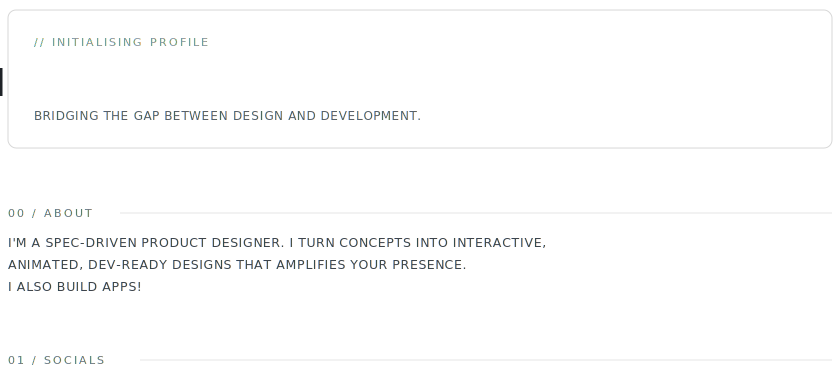
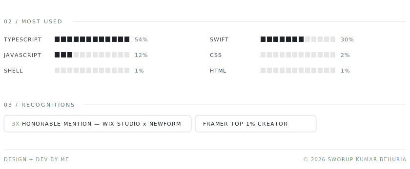

<picture>
  <source media="(max-width: 768px) and (prefers-color-scheme: dark)" srcset="./assets/banner-a-mobile-dark.svg">
  <source media="(max-width: 768px)" srcset="./assets/banner-a-mobile-light.svg">
  <source media="(prefers-color-scheme: dark)" srcset="./assets/banner-a-dark.svg">
  
</picture>

<a href="https://www.linkedin.com/in/sworup-behuria/"><picture><source media="(max-width: 768px)" srcset="./assets/soc-linkedin-mobile.svg"></picture></a> <a href="https://www.instagram.com/sworup_ku/"><picture><source media="(max-width: 768px)" srcset="./assets/soc-instagram-mobile.svg"></picture></a> <a href="https://x.com/sworup_ku"><picture><source media="(max-width: 768px)" srcset="./assets/soc-x-mobile.svg"></picture></a> <a href="https://www.sworupkumar.com/"><picture><source media="(max-width: 768px)" srcset="./assets/soc-portfolio-mobile.svg"></picture></a> <a href="mailto:hello@sworupkumar.com"><picture><source media="(max-width: 768px)" srcset="./assets/soc-email-mobile.svg"></picture></a>

<picture>
  <source media="(max-width: 768px) and (prefers-color-scheme: dark)" srcset="./assets/banner-b-mobile-dark.svg">
  <source media="(max-width: 768px)" srcset="./assets/banner-b-mobile-light.svg">
  <source media="(prefers-color-scheme: dark)" srcset="./assets/banner-b-dark.svg">
  
</picture>

<!--
  Repo: sworup-kumar/sworup-kumar  (must match your username exactly)
  Banners are responsive: mobile variants serve under 768px, desktop above.
  The GitHub-native activity graph renders automatically below this README.
  Language %s come from fetch_langs.py (live); recognitions/about live in build.py.
-->
