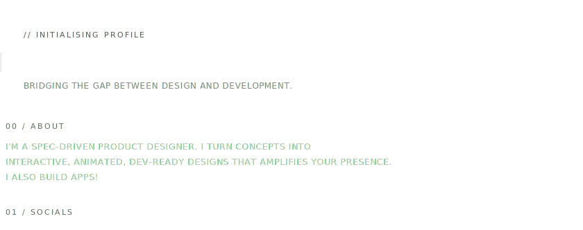
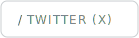
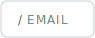
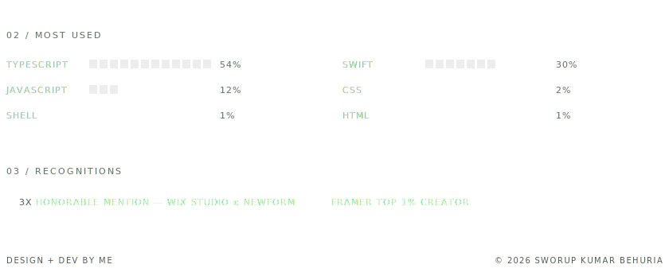

<picture>
  <source media="(prefers-color-scheme: dark)" srcset="./assets/banner-a-dark.svg">
  <source media="(prefers-color-scheme: light)" srcset="./assets/banner-a-light.svg">
  
</picture>

<picture>
  <source media="(prefers-color-scheme: dark)" srcset="./assets/banner-b-dark.svg">
  <source media="(prefers-color-scheme: light)" srcset="./assets/banner-b-light.svg">
  
</picture>

<!--
  Repo: sworup-kumar/sworup-kumar  (must match your username exactly)
  The GitHub-native activity graph renders automatically below this README.
  Language %s and recognitions are hand-set in build.py — edit + re-run to update.
-->
